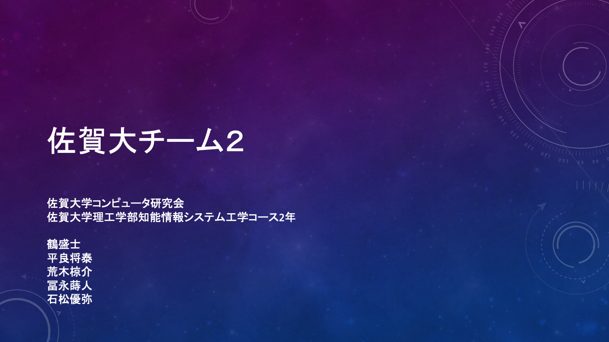
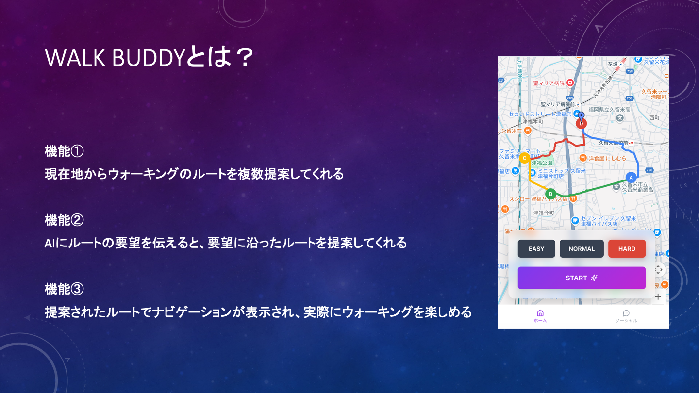
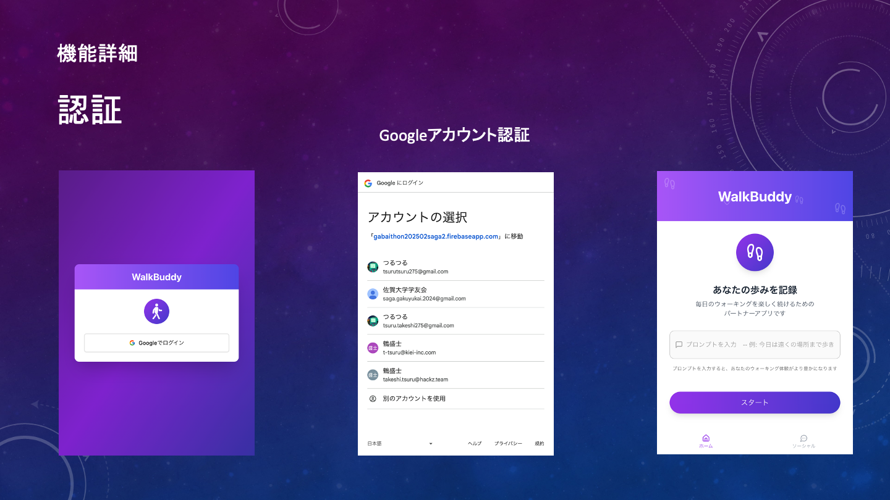
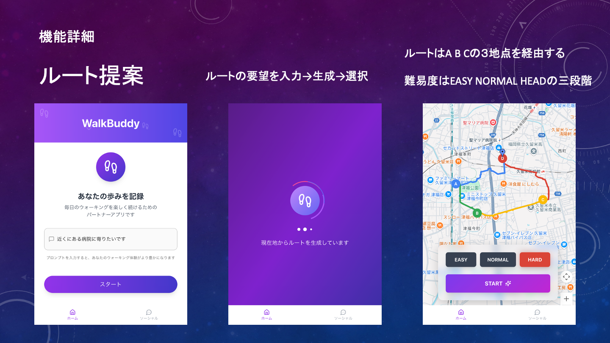
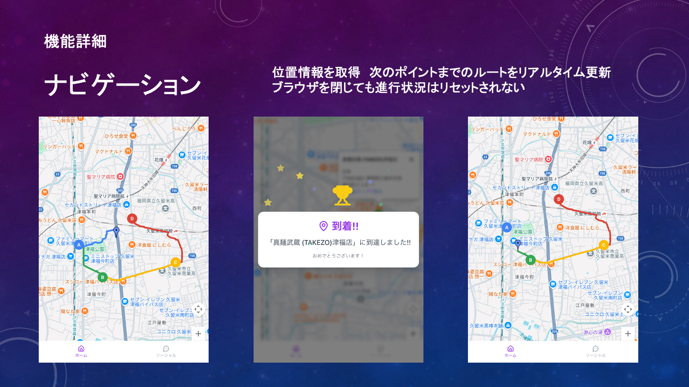
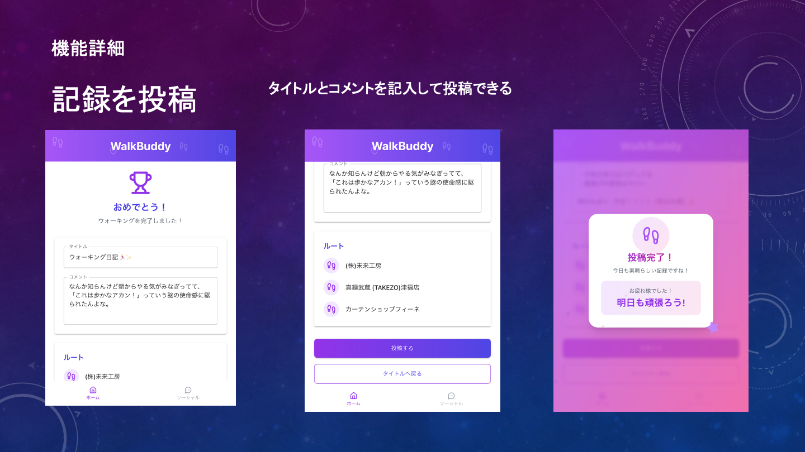

# 発表資料
















---


### PC から CloudSQL の PostgreSQL に接続する方法

1. Google Cloud SDK をインストールする
   https://cloud.google.com/sdk?hl=ja
1. postgresql をインストールする
   https://www.postgresql.jp/download

1. ログインする
   ```
   gcloud auth application-default login
   ```
1. Cloud SQL Auth Proxy を起動する

   - Windows の場合

   ```
   cloud-sql-proxy.exe gabaithon202502saga2:asia-northeast1:gabaithon202502saga2 --port 5432 --debug-logs --run-connection-test
   ```

   - Mac の場合

   ```
   ./cloud-sql-proxy gabaithon202502saga2:asia-northeast1:gabaithon202502saga2 --port 5432 --debug-logs --run-connection-test
   ```

   を実行する

1. DB に接続する

   別ターミナルで以下のコマンドを実行する

   ```
   psql -h 127.0.0.1 -d postgres -U postgres
   ```

   Password for user postgres:

   ```
   postgres
   ```

   接続完了、SQL 文を実行できる
